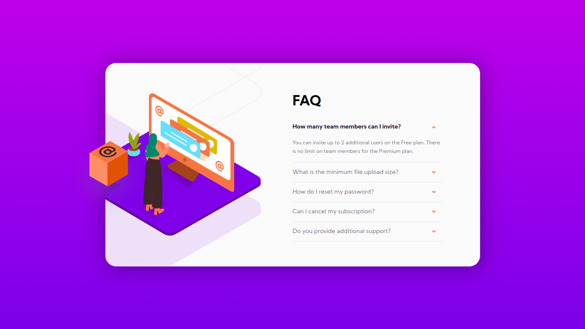

# Frontend Mentor - FAQ Accordion Card

A [Frontend Mentor](https://www.frontendmentor.io/challenges/faq-accordion-card-XlyjD0Oam) challenge, all code is of my own while design and assests are provided by Frontend Mentor.

View frequently asked questions by clicking on the question.

The mobile responsive accordian component is written in vanilla HTML and CSS using the details disclosure tag. Javascript is used to enable the smooth opening and closing of the questions on the accordian.

[View](https://faq-accordion-card-main-jet.vercel.app/) the componant!

